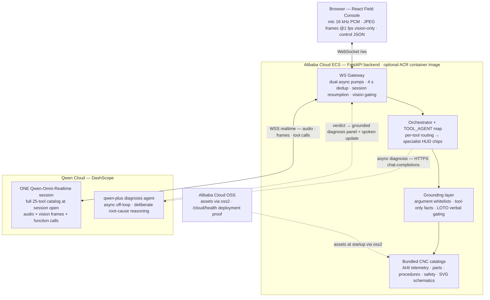

<div align="center">

# 🔧 FORGE
### Field Operations Real-time Guidance Engine

**A voice-activated, multimodal AI co-pilot for industrial field-service technicians — built on Qwen-Omni-Realtime + a qwen-plus diagnosis agent, on Alibaba Cloud.**

[](LICENSE)
[](https://www.alibabacloud.com/help/en/model-studio/realtime)
[](deploy/ALIBABA_CLOUD_PROOF.md)
[](docs/SUBMISSION.md)

</div>

---

## The problem

Unplanned downtime across manufacturing runs into **hundreds of thousands of dollars
per hour**. The technicians who fix these machines work with **both hands occupied**,
often gloved, in noisy environments — they cannot type or click. And the field
reports that drive compliance and the next shift's work are written **from memory,
hours later**, full of gaps.

The scale, in numbers:

- Unplanned downtime averages **~$260,000/hour** across manufacturing (cross-sector average) — roughly **50% higher than in 2019** ([Aberdeen Group / Siemens, via info2soft](https://www.info2soft.com/blogs/unplanned-downtime-cost-2026-updated.html)).
- **61%** of manufacturers were hit by unplanned downtime in the past year, costing the sector **up to $852M/week** ([Fluke Corporation](https://www.globenewswire.com/news-release/2025/10/30/3177330/0/en/Unplanned-Downtime-Costs-Manufacturers-Up-to-852M-Weekly-Exposing-Critical-Vulnerabilities-in-Industrial-Resilience.html) — Censuswide survey, 600+ decision-makers, US/UK/Germany).
- Roughly **1 in 4** service visits fails to fix the problem on the first trip — and in **industrial machinery**, FORGE's exact domain, it's nearly **3 in 10**. First-time-fix rates sit at **76–77%** across field service ([Aquant 2024 Field Service Benchmark Report](https://21176235.fs1.hubspotusercontent-na1.net/hubfs/21176235/ebook-2024-benchmarkreport-12-19.pdf) — all-industry median 76%, industrial-machinery median **71.9%**; Service Council ~77% via [ServicePower](https://www.servicepower.com/blog/top-3-field-service-metrics)).
- **~75%** of field technicians say they spend too much time on paperwork ([Skedulo](https://www.skedulo.com/blog/workforce-utilization-in-field-service/), citing Service Council's *Voice of the Field Service Engineer*, 2021) — so the reports that drive compliance and the next shift's work get written from memory, hours later.
- And a co-pilot that *confidently hallucinates* a torque spec or part number doesn't save time — it destroys a spindle. Trustworthiness is the whole ballgame.

## The product

The technician wears a head-cam (or points a phone) and simply **talks**. FORGE:

- **Listens continuously** and responds in under a second — no button press.
- **Sees** the machine through a live video feed: reads nameplates, gauges, error
  codes, spindle/tool engagement, chip formation.
- **Acts** on screen — pulls the right schematic, navigates to a labeled component,
  shows torque specs, runs a lockout/tagout (LOTO) safety checklist with verbal
  confirmation at each step.
- **Documents** every action with timestamps into a structured work order *as the
  job happens*.
- **Hands off** — generates the completion report and shift handoff at case close.

All of this runs in **one bidirectional `Qwen-Omni-Realtime` session** — audio in,
audio out, function calling, and live image streaming at once.

## The CNC asset

Every layer — telemetry, schematics, parts, procedures, demo feed — is coherent to a
single machine: a **CNC vertical machining center / turn-mill** (synthetic registry
modeled on a commercial PL45LM-class turn-mill).

The engine itself isn't CNC-specific: the pattern — continuous voice + live vision +
grounded tool-calling over a structured equipment catalog — carries to other field-service
domains such as HVAC, elevators, turbines, and medical devices; the CNC turn-mill is the
fully-built reference vertical.

---

## Architecture at a glance



See [docs/architecture.md](docs/architecture.md) for the full diagram.

> **Why one realtime session plus one reasoning agent — not a mesh of sub-agents?** This
> is a deliberate latency architecture — a System-1/System-2 split. FORGE keeps a single
> flat Qwen-Omni-Realtime session carrying all 25 grounded tools, so the voice loop stays
> sub-second: no runtime handoffs, no tool call dropped mid-transfer, one connection to
> resume after a network blip — and the specialist HUD chips still give full per-tool
> attribution without paying any swap cost. Deep failure analysis doesn't belong on that
> hot path: it runs on a second agent (`qwen-plus`, async HTTPS chat-completions) that
> reasons off the realtime loop and hands a structured verdict back into the session as a
> grounded diagnosis panel plus a spoken update. A swap-based session-transfer layer was
> prototyped and unit-tested during development and deliberately kept out of the runtime —
> it would add handoff latency and mid-swap tool-call risk without adding any capability
> the flat session + per-tool routing doesn't already deliver.

### Two agents, two Qwen models — a System-1/System-2 split

FORGE runs **two cooperating agents on two Qwen models**, and neither blocks the other:

- **Front agent — `qwen3.5-omni-plus-realtime` (System-1).** One bidirectional session that listens,
  sees the camera, and drives all 25 grounded tools in sub-second turns. By design it does no deep
  failure analysis — latency is the priority.
- **Diagnosis agent — `qwen-plus` (System-2).** Slow, deliberate root-cause reasoning over HTTPS
  chat-completions (default; `FORGE_DIAGNOSTIC_MODEL`, same DashScope key), run **asynchronously off
  the realtime loop** so the voice conversation never stalls waiting on it.
- **Three triggers, one single-flight scheduler.** A diagnosis is scheduled by a telemetry threshold
  breach on `record_measurement`, by the autopilot workflow's diagnosis step, or by an on-demand
  "diagnose…" request — de-duped so a given condition is analysed once.
- **Grounded handback, not chatter.** The structured verdict (root cause · confidence · recommended
  action · evidence) lands as a machine-data **`diagnosis` panel section** the technician sees, plus a
  silently-injected context line FORGE reads aloud **only when asked** — it never barges in.

See [`backend/app/agents/diagnostic.py`](backend/app/agents/diagnostic.py).

---

## Repository layout

```
backend/    FastAPI WebSocket gateway, realtime session, agents, tools, grounding, cloud, data
frontend/   React + Vite + TypeScript + Tailwind field console (panels + HUD)
docs/       architecture · SUBMISSION · DEMO_SCRIPT · BLOG
deploy/     ALIBABA_CLOUD_PROOF · ECS manifests
datasets/   source data on disk (AI4I CSV + the CNC demo clip cnc2.mp4 bundled; other test videos gitignored)
```

---

## Quickstart (local development)

> **Only `DASHSCOPE_API_KEY` is required to run locally.** FORGE talks to the live
> `Qwen-Omni-Realtime` model (there is no offline/mock mode), but **Alibaba Cloud
> OSS/ECS credentials are optional** — without them the backend, frontend, tests, and
> the full voice loop all run; only the cloud asset-fetch and the OSS half of
> `/cloud/health` are disabled (logged as an info line at startup, never a crash).

```bash
# 1. Backend
cd backend
python -m venv .venv && source .venv/bin/activate
pip install -r requirements.txt
echo "DASHSCOPE_API_KEY=sk-..." > .env   # the only var needed for local dev
uvicorn app.main:app --reload --port 8000

# 2. Frontend (separate terminal)
cd frontend
npm install
npm run dev                      # http://localhost:5173

# 3. Live feed (the "camera")
#    In the Field Vision panel, toggle 👁 Vision, click the "🎞 Video file" button,
#    then "Choose a CNC clip…" and pick datasets/cnc2.mp4 — the console streams it
#    as the vision source (no camera or extra tooling needed). This is what the demo uses.
#    (📷 Camera mode also works with a real webcam/phone cam; for a webcam-style route to
#    the clip, load it in OBS Studio, start OBS Virtual Camera, switch to 📷 Camera, and
#    select that device in the picker. 🖥 Share screen streams a SCADA/monitor view instead.)
```

### Hermetic tests (no API key needed)
```bash
cd backend && pytest            # pure layers: catalogs, grounding, tools, schemas, dedup, thresholds
cd frontend && npm run build    # zero TypeScript errors
```

---

## Roadmap

Directions beyond the current build — the CNC vertical is what ships today:

- **Multi-asset catalogs** — grow from the single CNC registry to a library of machines.
- **Live telemetry** — ingest real PLC / MTConnect / OPC-UA streams in place of the bundled AI4I dataset.
- **Additional verticals** — HVAC, elevators, turbines, medical devices, each behind its own grounded catalog.
- **RAG over OEM manuals** — answer from real manufacturer documentation with citations back to the page (today's specs are hand-authored into structured JSON).
- **CMMS / ERP integration** — push the generated work order and shift handoff into maintenance systems.
- **Edge buffering** — ride out low-connectivity shop floors without losing the session or work log.

## Data & attribution

All reference data is bundled static files; the only runtime network calls are to
Qwen (DashScope) and Alibaba Cloud OSS. Every dataset, video, and manual source with
its license is listed in **[DATA_SOURCES.md](DATA_SOURCES.md)**.

## Hackathon

Track 4 — **Autopilot Agent**. Submission write-up
and judging-criteria mapping in **[docs/SUBMISSION.md](docs/SUBMISSION.md)**; demo
script in **[docs/DEMO_SCRIPT.md](docs/DEMO_SCRIPT.md)**; deployment proof in
**[deploy/ALIBABA_CLOUD_PROOF.md](deploy/ALIBABA_CLOUD_PROOF.md)**.

Demo video: https://youtu.be/ifMU-fvNbVk · Repository: https://github.com/kaushikchaturvedula/FORGE · Build journey (blog): https://medium.com/@kaushikchaturvedula/building-forge-a-voice-co-pilot-that-sees-the-machine-9a702b4c2147

## License

[Apache 2.0](LICENSE).
