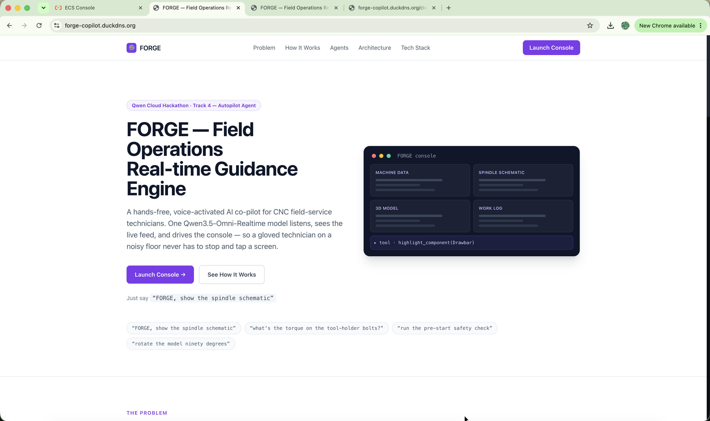
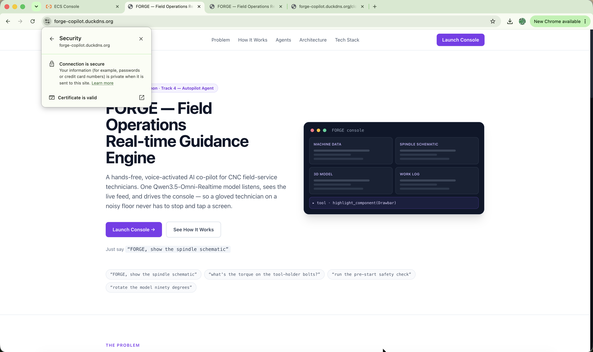
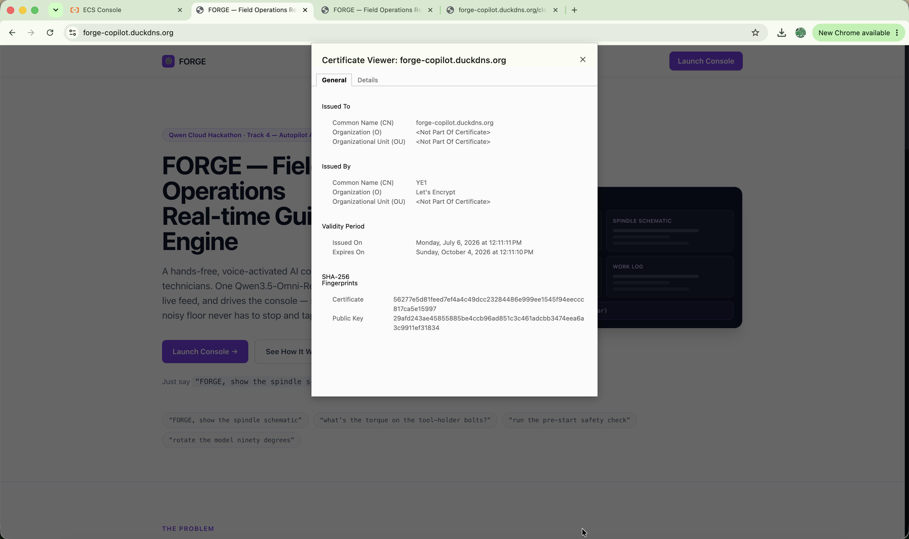
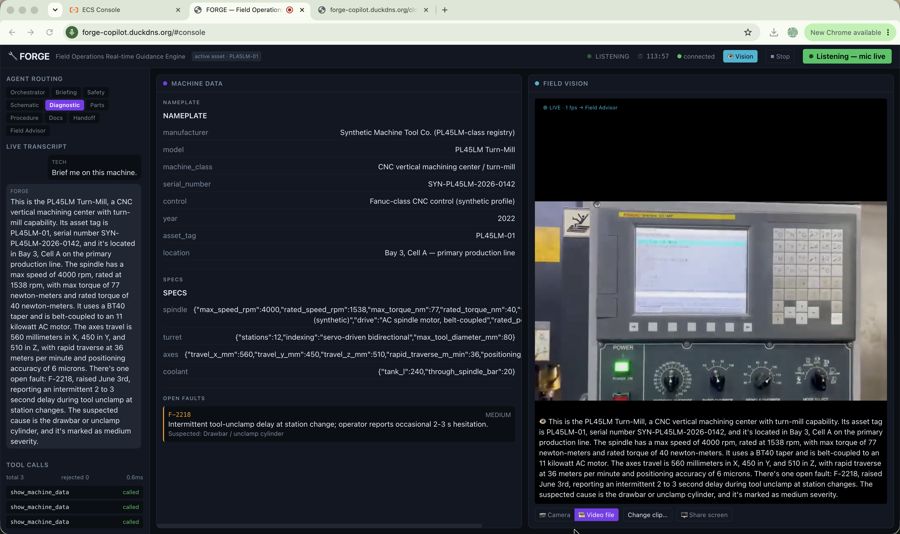
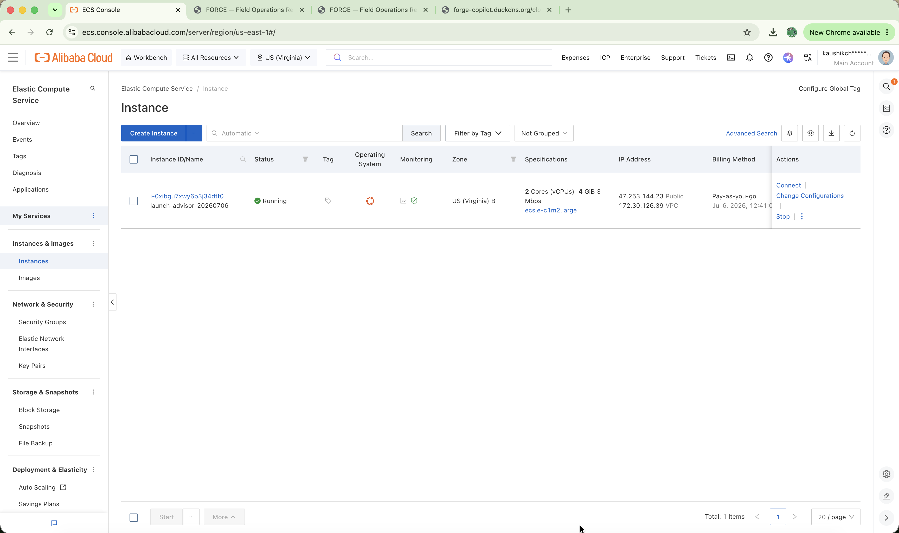
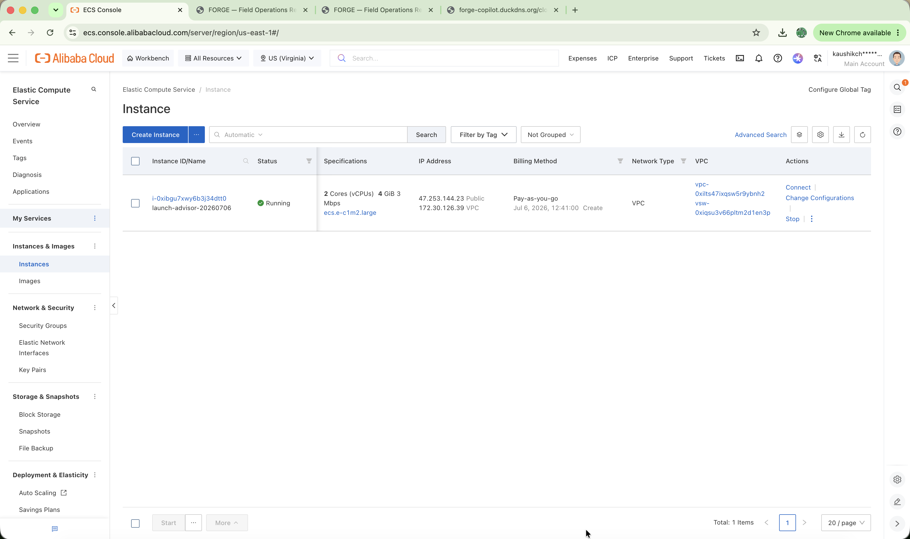
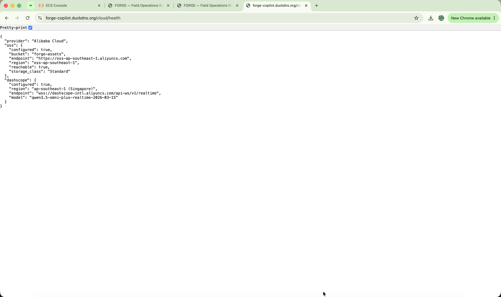
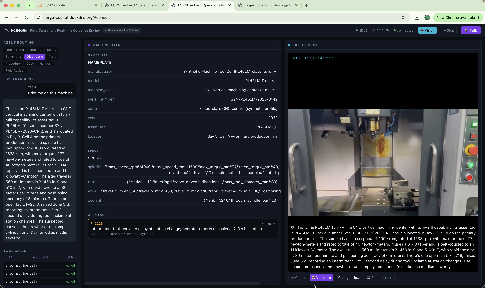
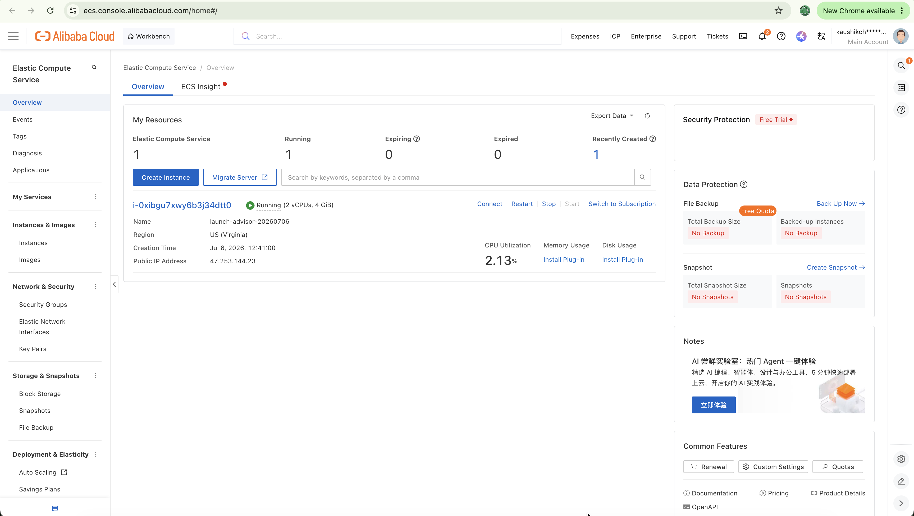

# Alibaba Cloud Deployment Proof

FORGE runs end-to-end on Alibaba Cloud. This document is the single place a judge can
verify that — the live URL, the recording, and the exact code that calls Alibaba Cloud
services.

## 1. Live service

- **App URL (ECS · uvicorn behind Caddy, auto-TLS):** `https://forge-copilot.duckdns.org`
- **Health:** `https://forge-copilot.duckdns.org/healthz`
- **Cloud proof endpoint:** `https://forge-copilot.duckdns.org/cloud/health`
- **Deployment recording (unlisted):** https://youtu.be/6qgV8-hwQhQ

**Deployment status.** Deployed and externally verified **live on Jul 6, 2026** — the
landing page, a mic-live console voice round-trip, `/healthz`, and `/cloud/health` were
all green (captured in the recording above and the screenshots below). It was served over
HTTPS by **Caddy** (automatic Let's Encrypt TLS) on ECS instance `i-0xibgu7xwy6b3j34dtt0`
(ecs.e-c1m2.large — 2 vCPU / 4 GiB, Ubuntu, US · N. Virginia, public IP 47.253.144.23,
pay-as-you-go, created Jul 6, 2026), with assets in OSS bucket `forge-assets`
(ap-southeast-1, Singapore) and the realtime model `qwen3.5-omni-plus-realtime-2026-03-15`
plus the async `qwen-plus` diagnosis agent on the DashScope international endpoint. **The
ECS instance and OSS bucket were released after evidence capture on Jul 6, 2026, to
conserve hackathon credits**, so the URL above is no longer live — the recording above,
the screenshots below, and the code links below are the durable proof.

`GET /cloud/health` returns the live OSS bucket region and the DashScope region the
realtime model is served from — proving both Alibaba Cloud services are in use:

```json
{
  "provider": "Alibaba Cloud",
  "oss": { "configured": true, "bucket": "forge-assets", "region": "oss-ap-southeast-1", "reachable": true },
  "dashscope": { "configured": true, "region": "ap-southeast-1 (Singapore)",
                 "endpoint": "wss://dashscope-intl.aliyuncs.com/api-ws/v1/realtime",
                 "model": "qwen3.5-omni-plus-realtime" }
}
```

## Screenshots (live-deployment evidence)


*FORGE landing page, served from the ECS deployment at `forge-copilot.duckdns.org`.*


*Landing page over HTTPS — the browser URL bar shows `https://forge-copilot.duckdns.org` with a valid lock.*


*TLS certificate — Let's Encrypt, CN `forge-copilot.duckdns.org`, valid Jul 6 → Oct 4, 2026.*


*Field console live with the microphone active — the realtime voice loop is connected.*


*Alibaba Cloud ECS console — instance `i-0xibgu7xwy6b3j34dtt0` in the **Running** state.*


*ECS console — instance **Running** (US · N. Virginia, public IP 47.253.144.23).*


*`GET /cloud/health` — all green: OSS `configured` + `reachable`, and the live DashScope model string.*


*Voice round-trip — a spoken command drives a grounded tool call that populates the Machine Data panel.*


*ECS instance details — ecs.e-c1m2.large (2 vCPU / 4 GiB), Ubuntu, pay-as-you-go*

## Code links (formal proof)

The hackathon asks for a link to a code file that demonstrates use of Alibaba Cloud
services and APIs. The most direct ones:

- [`backend/app/cloud/alibaba.py`](../backend/app/cloud/alibaba.py) — **OSS (Object Storage
  Service)** via the official `oss2` SDK (`oss2.Auth` / `oss2.Bucket`, `get_bucket_info`,
  object read/write); also serves the `/cloud/health` proof endpoint.
- [`backend/app/config.py`](../backend/app/config.py) — builds the **DashScope / Model
  Studio** endpoints (`wss://dashscope-intl.aliyuncs.com/api-ws/v1/realtime` and
  `https://dashscope-intl.aliyuncs.com/compatible-mode/v1`) and the model IDs.
- [`backend/app/realtime/session.py`](../backend/app/realtime/session.py) — opens the
  **DashScope realtime WebSocket** (`websockets.connect`) carrying audio, vision frames,
  and function calls.
- [`backend/app/agents/diagnostic.py`](../backend/app/agents/diagnostic.py) — the async
  `qwen-plus` diagnosis agent, POSTing to the **DashScope OpenAI-compatible**
  `chat/completions` endpoint.

## 2. Which Alibaba Cloud services and where in the code

| Service | What it does for FORGE | Code |
|---|---|---|
| **Model Studio / DashScope** (Qwen-Omni-Realtime) | The entire AI core — audio in/out, function calling, vision — over one realtime WebSocket | [backend/app/realtime/session.py](../backend/app/realtime/session.py), endpoint built in [backend/app/config.py](../backend/app/config.py) |
| **OSS** (Object Storage, via `oss2`) | Stores + serves the large static assets (CNC video, schematics) fetched at startup | [backend/app/cloud/alibaba.py](../backend/app/cloud/alibaba.py) — `read_object` / `download_object` / `oss_status` |
| **ACR** (Container Registry) | Hosts the built Docker image | [backend/Dockerfile](../backend/Dockerfile), pushed by [.github/workflows/deploy.yml](../.github/workflows/deploy.yml) |
| **ECS** (Elastic Compute Service) | Hosts the FastAPI backend with persistent (≤120 min) WebSocket sessions | [deploy/ecs/](./ecs/) — compose + nginx (long-lived WS timeouts) |

**Why ECS, not SAE or Function Compute:** the realtime bridge holds a WebSocket open
for up to ~120 minutes. Function Compute force-terminates long connections; SAE's
long-WebSocket behaviour behind its load balancer is not clearly documented (the ALB
default idle timeout is 60 s). ECS gives full control of the proxy timeouts — see
[deploy/ecs/nginx.conf](./ecs/nginx.conf) (`proxy_read_timeout 7800s`).

## 3. Reproduce the deploy

1. **OSS:** create bucket `forge-assets` (region e.g. `ap-southeast-1`); upload the
   CC BY 3.0 CNC clip (CNCBUL, YouTube) + schematics. (See [deploy/ecs/README.md](./ecs/README.md).)
2. **ACR:** create a namespace; CI pushes `forge:latest` + `forge:<sha>`.
3. **ECS:** provision an instance, install Docker + Compose, place
   `deploy/ecs/docker-compose.yml` + `nginx.conf` in `/opt/forge`, set the `.env`,
   `docker login` to ACR, `docker compose up -d`.
4. **CI/CD:** set the repo secrets listed in [ecs/README.md](./ecs/README.md);
   pushes to `main` then build → push to ACR → SSH roll-out on ECS automatically.

> **Reverse proxy note.** The repo ships the containerized nginx + Compose manifest above
> as the reproducible deployment path, while the recorded Jul 6, 2026 deployment ran the
> same FastAPI backend directly via uvicorn behind Caddy (automatic Let's Encrypt TLS) —
> both serve the identical app.

## 4. Secrets (repo + ECS `.env`)

`DASHSCOPE_API_KEY`, `ALIBABA_CLOUD_ACCESS_KEY_ID`, `ALIBABA_CLOUD_ACCESS_KEY_SECRET`,
`OSS_BUCKET`, `OSS_ENDPOINT`, `OSS_REGION`, and for CI: `ACR_REGISTRY`, `ACR_NAMESPACE`,
`ACR_USERNAME`, `ACR_PASSWORD`, `ECS_HOST`, `ECS_USER`, `ECS_SSH_KEY`. None are committed.
