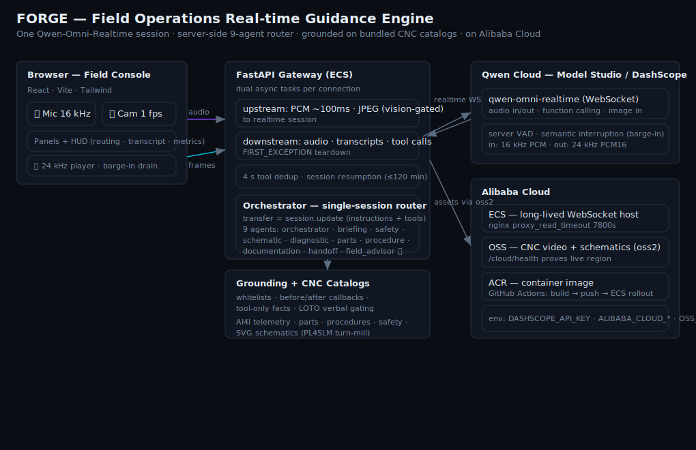
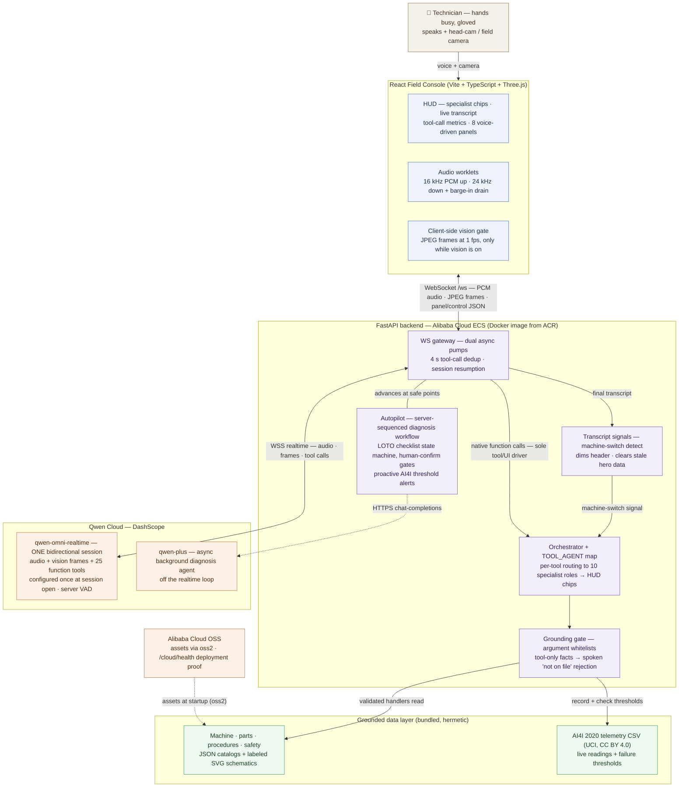

# FORGE Architecture

> The diagram above (`architecture.svg`) is generated from the Mermaid source below
> (`@mermaid-js/mermaid-cli`); GitHub also renders the Mermaid natively.

## The one-line idea

A field technician with both hands occupied **talks**; FORGE listens, sees through a
live camera, acts on the console, and documents the job — all in **one
Qwen-Omni-Realtime bidirectional session** (audio in/out + function calling + image
streaming at once), grounded so it can never recite a spec it didn't fetch.

## System diagram (Mermaid)

### Where each box lives

| Box | Code |
|---|---|
| Field Console (HUD, panels, audio, vision gate) | [`frontend/src/App.tsx`](../frontend/src/App.tsx), [`hooks/useRealtimeSocket.ts`](../frontend/src/hooks/useRealtimeSocket.ts), [`audio/`](../frontend/src/audio/) |
| WS gateway (pumps, dedup, resumption, TOOL_AGENT) | [`backend/app/ws/gateway.py`](../backend/app/ws/gateway.py) |
| Transcript signals (machine-switch detection) | [`backend/app/agents/intent.py`](../backend/app/agents/intent.py) |
| Orchestrator (grounded tool executor) + specialist registry | [`backend/app/agents/orchestrator.py`](../backend/app/agents/orchestrator.py), [`specialists.py`](../backend/app/agents/specialists.py) |
| Grounding gate | [`backend/app/grounding/whitelists.py`](../backend/app/grounding/whitelists.py), [`callbacks.py`](../backend/app/grounding/callbacks.py) |
| Diagnosis workflow · LOTO state machine · alerts | [`backend/app/agents/workflows.py`](../backend/app/agents/workflows.py), [`tools/handlers.py`](../backend/app/agents/tools/handlers.py) |
| Background diagnosis agent (qwen-plus) | [`backend/app/agents/diagnostic.py`](../backend/app/agents/diagnostic.py) |
| Data layer (catalogs, telemetry, schematics) | [`backend/app/data/`](../backend/app/data/) |
| Realtime session (WSS, one session.update at open) | [`backend/app/realtime/session.py`](../backend/app/realtime/session.py), [`events.py`](../backend/app/realtime/events.py) |
| OSS + deployment proof | [`backend/app/cloud/alibaba.py`](../backend/app/cloud/alibaba.py) |
| Models + endpoints config | [`backend/app/config.py`](../backend/app/config.py) |

## Why these decisions

**One flat realtime session, specialist attribution per tool.** AgentScope's realtime
support is single-agent; a true multi-agent realtime *transfer* is unproven and its
DashScope wrapper may not forward tool-calls. So FORGE keeps **one** Qwen realtime
session, configured once at session open with the full grounded tool catalog. The
specialist layer is per-tool routing: every executed tool is attributed to its owning
specialist (the gateway's `TOOL_AGENT` map) and surfaced as routing chips + a routing
log in the HUD. A swap-based transfer layer (`session.update` exchanging instruction/
tool bundles per handoff) was designed, implemented, and unit-tested during development,
but the shipped runtime deliberately runs the flat session — no swap latency, no risk of
dropped tool calls mid-swap, simpler session resumption — and still sidesteps the "every
agent needs a realtime model" failure mode entirely.
See [`backend/app/agents/orchestrator.py`](../backend/app/agents/orchestrator.py) and
[`specialists.py`](../backend/app/agents/specialists.py).

**Native-first tool routing.** The realtime model's own function calls are the sole
driver of tools and UI. An earlier build ran a deterministic transcript→tool inference
layer alongside the model's calls; it was removed because it double-fired tools, fought
the model on compound commands, and drifted from the persona's few-shots. The model now
decides *what* to call (reliability is engineered in the persona's multi-task examples in
[`voice.py`](../backend/app/agents/voice.py)), and the server owns *what's true* —
grounding validation, panel/section state, and dedup. The one surviving transcript check
is machine-switch detection ([`intent.py`](../backend/app/agents/intent.py)): on "I'm on a
different machine now" the gateway dims the header and clears stale hero data — a UX beat
the model shouldn't have to infer.

**Grounding is structural, not prompted-hope.** Every fact-bearing answer must come
from a tool call, and every tool argument is validated against the catalog before the
handler runs ([`grounding/whitelists.py`](../backend/app/grounding/whitelists.py),
[`callbacks.py`](../backend/app/grounding/callbacks.py)). An unknown part or torque is
rejected with a spoken "I don't have that on file" — a hallucinated spec is impossible.

**Robust transport.** The dual-task bridge
([`ws/gateway.py`](../backend/app/ws/gateway.py)) joins with `FIRST_EXCEPTION` (never
`FIRST_COMPLETED`, which kills multi-turn sessions), de-dups duplicate function-call
events in a 4 s window, gates the video stream on the Field Advisor to control tokens,
and transparently resumes the realtime session near its 120-minute cap with a
compressed context summary.

**Audio.** Input is 16 kHz mono PCM (browser AudioWorklet); output is **24 kHz** PCM16
(Qwen) played with a small jitter buffer that drains instantly on a server
speech-started event (barge-in). Turn-taking and interruption are handled by Qwen
**server VAD + semantic interruption** — no custom VAD.

**Alibaba Cloud.** ECS hosts the long-lived WebSocket (full control of proxy timeouts);
OSS stores the large assets and doubles as deployment proof via
[`cloud/alibaba.py`](../backend/app/cloud/alibaba.py) + `/cloud/health`; ACR holds the
image; GitHub Actions builds, pushes, and rolls out. ECS is chosen over SAE/Function
Compute precisely because of the 120-minute WebSocket requirement.

## Request lifecycle (a single spoken command)

1. Browser streams 16 kHz PCM; Qwen server-VAD detects end-of-turn and transcribes.
2. The model decides to call a tool → `response.function_call_arguments.done`.
3. Gateway de-dups, the grounding layer validates args, the handler reads the catalog.
4. The gateway attributes the tool to its owning specialist (`TOOL_AGENT`) and lights that routing chip in the HUD.
5. The grounded result is returned to the model (`function_call_output` + `response.create`).
6. The model speaks the result as 24 kHz audio; the matching panel updates on the console.
7. Every step is timestamped into the work-order log for the report and handoff.
