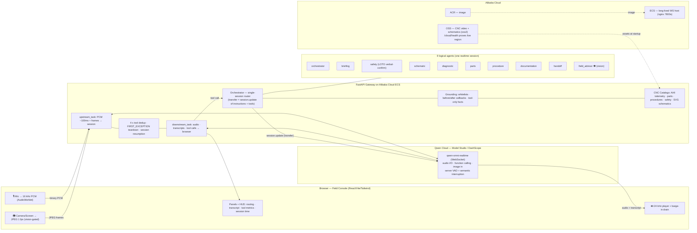

# FORGE Architecture

> The exported diagram above (`architecture.svg`) and the Mermaid source below are the
> same system. Render the Mermaid live on GitHub.

## The one-line idea

A field technician with both hands occupied **talks**; FORGE listens, sees through a
live camera, acts on the console, and documents the job — all in **one
Qwen-Omni-Realtime bidirectional session** (audio in/out + function calling + image
streaming at once), grounded so it can never recite a spec it didn't fetch.

## System diagram (Mermaid)

## Why these decisions

**One realtime session, nine logical agents.** AgentScope's realtime support is
single-agent; a true multi-agent realtime *transfer* is unproven and its DashScope
wrapper may not forward tool-calls. So FORGE keeps **one** Qwen realtime session and
implements the hierarchy server-side: each "agent" is a bundle of
`(instructions, tool-subset, voice)`, and a *transfer* is a `session.update` that swaps
that bundle while the conversation continues. This gives the full multi-agent UX
(routing log, agent chips, scoped tools) with none of the multi-session fragility and
sidesteps the "every agent needs a realtime model" failure mode entirely.
See [`backend/app/agents/orchestrator.py`](../backend/app/agents/orchestrator.py) and
[`specialists.py`](../backend/app/agents/specialists.py).

**Grounding is structural, not prompted-hope.** Every fact-bearing answer must come
from a tool call, and every tool argument is validated against the catalog before the
handler runs ([`grounding/whitelists.py`](../backend/app/grounding/whitelists.py),
[`callbacks.py`](../backend/app/grounding/callbacks.py)). An unknown part or torque is
rejected with a spoken "I don't have that on file" — a hallucinated spec is impossible.

**Robust transport.** The dual-task bridge
([`ws/gateway.py`](../backend/app/ws/gateway.py)) joins with `FIRST_EXCEPTION` (never
`FIRST_COMPLETED`, which kills multi-turn sessions), de-dups duplicate function-call
events in a 4 s window, gates the video stream on the Field Advisor to control tokens,
and transparently resumes the realtime session near its 120-minute cap with a
compressed context summary.

**Audio.** Input is 16 kHz mono PCM (browser AudioWorklet); output is **24 kHz** PCM16
(Qwen) played with a small jitter buffer that drains instantly on a server
speech-started event (barge-in). Turn-taking and interruption are handled by Qwen
**server VAD + semantic interruption** — no custom VAD.

**Alibaba Cloud.** ECS hosts the long-lived WebSocket (full control of proxy timeouts);
OSS stores the large assets and doubles as deployment proof via
[`cloud/alibaba.py`](../backend/app/cloud/alibaba.py) + `/cloud/health`; ACR holds the
image; GitHub Actions builds, pushes, and rolls out. ECS is chosen over SAE/Function
Compute precisely because of the 120-minute WebSocket requirement.

## Request lifecycle (a single spoken command)

1. Browser streams 16 kHz PCM; Qwen server-VAD detects end-of-turn and transcribes.
2. The model decides to call a tool → `response.function_call_arguments.done`.
3. Gateway de-dups, the grounding layer validates args, the handler reads the catalog.
4. If it's a transfer, the gateway sends a `session.update` swapping the active agent.
5. The grounded result is returned to the model (`function_call_output` + `response.create`).
6. The model speaks the result as 24 kHz audio; the matching panel updates on the console.
7. Every step is timestamped into the work-order log for the report and handoff.
